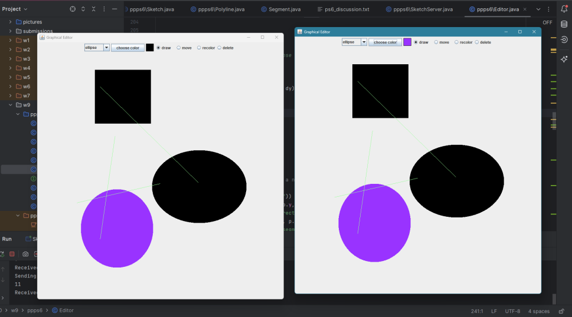

# Collaborative Canvas Sketchpad

A real-time collaborative canvas sketchpad for multiple users connected via socket streaming. This project allows users to create, edit, move, recolor, and delete shapes on a shared canvas. Multiple clients can interact with the same canvas simultaneously, with changes broadcast to all users in real-time.



## Features
- **Real-time synchronization**: Multiple users can collaborate on the same canvas, and changes are reflected across all client editors instantly.
- **Shape creation and manipulation**: Users can draw and modify **rectangles**, **ellipses**, **polylines**, and **freehand shapes**.
- **Interactive GUI**: Built with Java Swing, the GUI allows users to select, move, recolor, or delete shapes using simple drag-and-drop actions.
- **Socket communication**: The server and clients communicate through socket streaming to handle drawing actions and synchronization.
- **Multi-threaded server**: The server handles multiple client connections concurrently, ensuring smooth communication.

## Architecture

### Server
- **SketchServer.java**: The server component that manages the shared canvas. It handles requests from clients and synchronizes the shapes in a global canvas.
- **SketchServerCommunicator.java**: Manages communication between the server and each client. It handles parsing messages and sending updates to all connected clients.
  
### Client
- **Editor.java**: The client-side graphical editor, providing an interactive interface where users can add and modify shapes.
- **EditorCommunicator.java**: Responsible for sending drawing commands to the server and receiving updates to render changes from other clients.
  
### Shape Classes
- **Shape.java**: An interface that defines basic properties for shapes (e.g., color, position).
- **Ellipse.java, Rectangle.java, Polyline.java, Segment.java**: Implementations of different shape types with unique drawing behaviors.

### Synchronization
- **Synchronized methods**: The server uses synchronized methods to ensure that multiple threads can safely access and modify the global sketch, preventing data corruption when multiple clients attempt to edit shapes simultaneously.
  
  **Synchronization locks** are particularly important when modifying the shared `TreeMap` of shapes in the `Sketch.java` class, ensuring that each operation (e.g., delete, move, recolor) is completed without interference from other threads.

## Installation

1. Clone this repository:
   ```bash
   git clone https://github.com/yourusername/collab-sketchpad.git 
   ```
2. Compile the project using your preferred IDE or the command line:
    ```bash
    javac *.java
    ```
3. Run the server and client:
    ```bash
    java SketchServer
    java Editor
    ```
4. Open multiple clients to test real-time collaboration.

## Testing and Safety Checks
- Concurrency Handling: The system is designed to handle multiple users editing the canvas at the same time. Methods like moveShape, deleteShape, and recolorShape are synchronized to prevent conflicts.
- Edge Cases: To prevent errors such as a shape being deleted twice simultaneously, safety checks are implemented to verify the existence of the shape in the TreeMap before performing any operation.

## Further Enhancements
- Undo/Redo: Implement support for undo and redo actions.
- Shape Locking: Add functionality for clients to lock specific shapes, preventing others from modifying them.
- Access Control: Implement role-based access control where only authorized clients can edit the canvas.


Note: This project was made during Dartmouth's CS10 class.